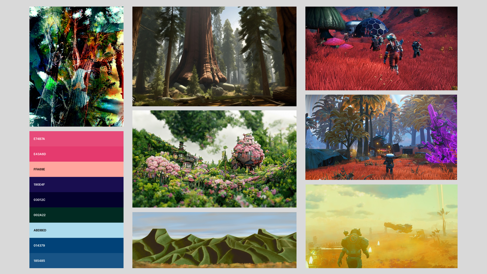
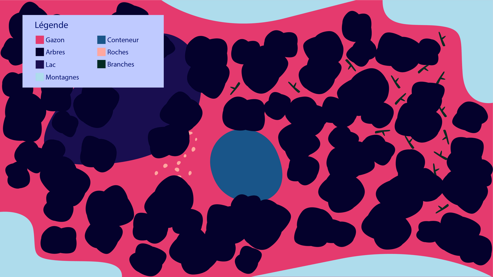
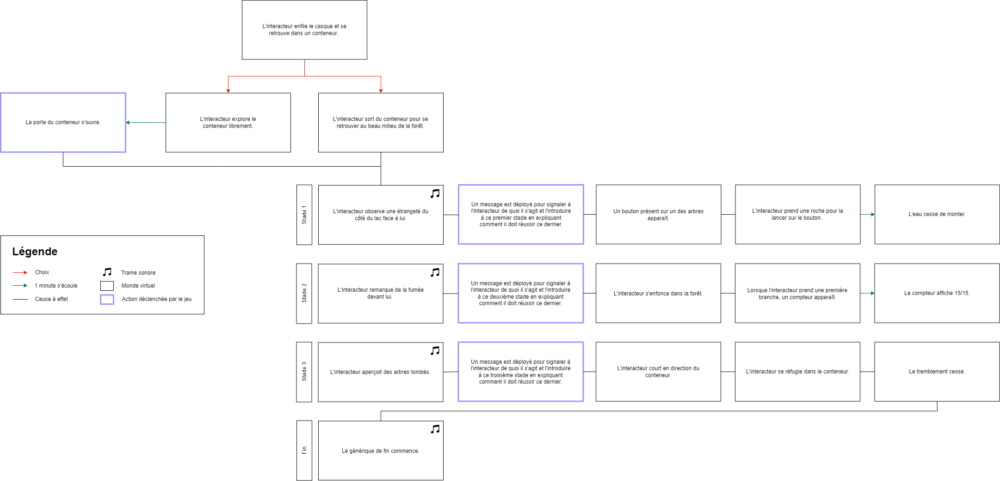
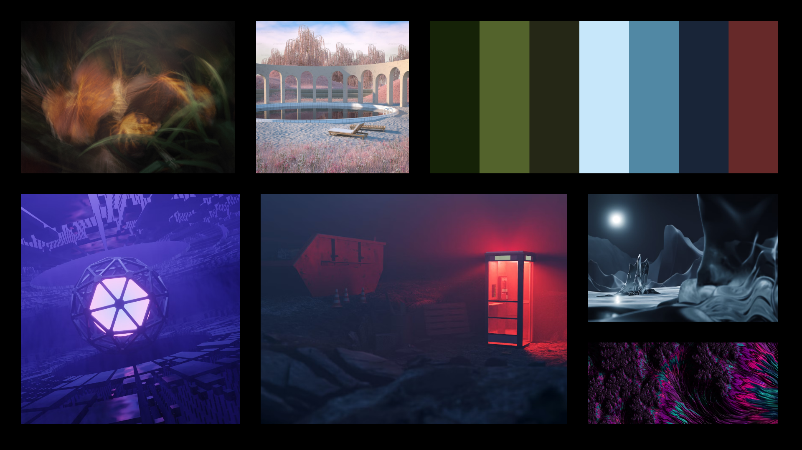
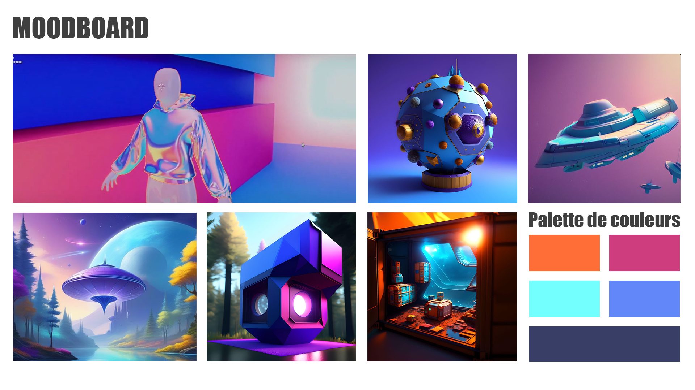
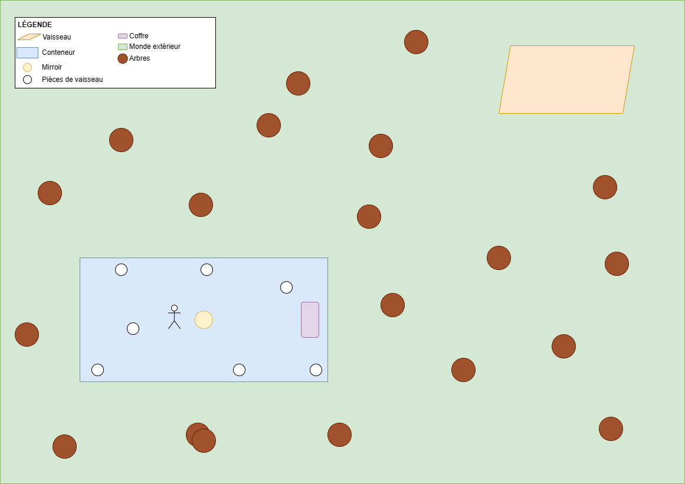
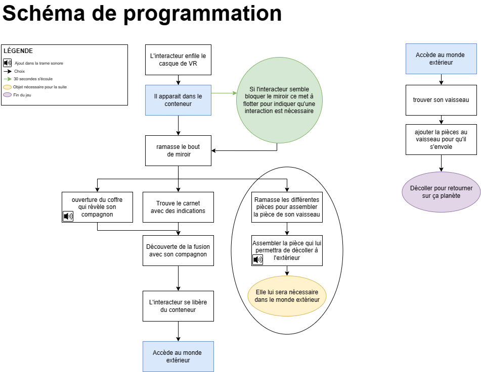

# Projet final VR

## Plan de projet de Camélie

### Résumé

Coincé dans un environnement étranger ressemblant à une forêt, nous nous retrouves face à différentes épreuves que nous nous devons de résoudre pour assurer notre survie.

### Description

Le projet se déroule en trois stades dont chacun mène au prochain. D'abord, nous commençons le premier stade dans un conteneur qui fait office de notre refuge. Celui-ci est situé dans la forêt. Au moment d'en sortir, nous observons une anormalité dans le lac. L'eau monte davantage jusqu'à en sortir de sa délimitation. Un décompte apparaît et un bouton se présente dans un des arbres. Comment survivre ? En appuyant sur le bouton à l'intérieur du temps offert et au moyen des dix roches se retrouvant au sol. Ensuite, le froid nous frappe nous rendant davantage faibles et vers la perte totale de nos moyens. Afin d'éviter une éventuelle hypothermie, un feu est essentiel et cela, en ramassant l'ensemble des quinze branches éparpillées dans la forêt dans un périmètre délimité. Attention, nous avons un temps limité qui nous est accordé. Enfin, à la dernière branche prise, une autre catastrophe se produit : les arbres se mettent à tomber dû à un énorme tremblement. Il n'y a pas de temps à perdre, il faut que nous revenions à notre habitation le plus vite possible pour se protéger et empêcher notre écrasement sous un arbre. 

### Moodboard visuel 

### Moodboard sonore

[Effets sonores](https://pixabay.com/fr/sound-effects/)

> Epic Hybrid Logo par Ivan_Luzan

> Brain Damage par daub_audio

> Horror Hit Logo par Alex_Kizenkov

> Wrong Place par SoundReality

### Carte

### Schéma de programmation

## Plan de projet de Ghita

### Résumé

Notre expérience VR consistera à se sortir d’une sorte d’Escape Room à la Hunger Games avec les éléments comme tribus.

### Description

Notre expérience VR sera un jeu divisé en 3 différents paliers. Le premier palier étant que l’utilisateur se retrouve bloqué dans un bunker et ne sait pas du tout où il est. Soudainement, une voix surgit lui expliquant qu’il a un temps limité pour frapper les différentes cibles qui apparaissent devant lui. Plus le temps passe, plus de l’eau montera jusqu’à noyer complètement le joueur s’il échoue. Cependant, si le défi est atteint, le joueur passe au prochain palier : allumer un feu. En effet, dès le passage au deuxième palier, l’utilisateur se voit projeter vers une nouvelle scène qui est glaciale. Ici encore, le joueur aura un temps limité pour ramasser un tel nombre de branches pour faire un feu. Une fois cela fait, le troisième palier est déclenché : le tremblement de terre. Le joueur devra se rendre aussi vite qu’il peut vers la porte de sortie. Une fois les trois paliers finis, le joueur remporte la partie.

### Moodboard visuel 

### Moodboard sonore

> https://www.youtube.com/watch?v=uvYtBlezsoI&ab_channel=TheWizard : Pour la course vers la porte de sortie – Ambiance assez pesante, rythme rapide

> https://www.youtube.com/watch?v=nkawBVYs49Q&ab_channel=RelaxtronautSounds : Pour le vent de l’ambiance glaciale 

> https://www.youtube.com/watch?v=u53yNFMMTL8&ab_channel=SoundEffectDatabase : Exemple de bruit pour ramasser les objets 

> https://www.youtube.com/watch?v=xNN7iTA57jM&ab_channel=TheGuildofAmbience : Ambiance forêt

### Carte

### Schéma de programmation

## Plan de projet de Vincent

### Résumé

Coincés à l'intérieur d'un conteneur mystérieux, accompagnés d'un guide surnaturel, nous résolvons des énigmes à chaque étape pour échapper à notre confinement et découvrir la forêt qui nous attend à l'extérieur.
### Description

Plongés dans l'obscurité totale, les joueurs débutent leur aventure dans un monde mystérieux. Une fêlure de lumière provenant du toit attire leur attention, illuminant un miroir au sol. En saisissant ce miroir, ils devront habilement diriger la lumière pour éclairer la pièce, révélant progressivement son environnement. La quête se poursuit alors que la lumière dévoile un coffre caché, libérant un compagnon qui devient leur source de lumière constante, tout en dévoilant les secrets du monde qui les entoure. Au fur et à mesure que l'aventure progresse, la mission évolue vers la découverte et l'assemblage des morceaux disséminés pour réparer un vaisseau spatial, fusionner avec le compagnon pour traverser les murs du conteneur, et enfin, s'envoler vers leur planète d'origine une fois le vaisseau restauré.
### Moodboard visuel 
https://www.youtube.com/watch?v=DktXmOBHJbM : compagnon

### Moodboard sonore
https://www.youtube.com/watch?v=6JeZR13dLLI (40min) Drone d'ambiance
### Carte

### Schéma de programmation

